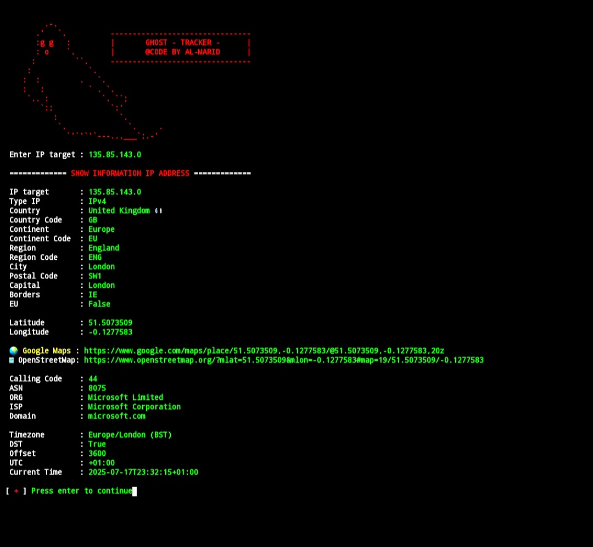
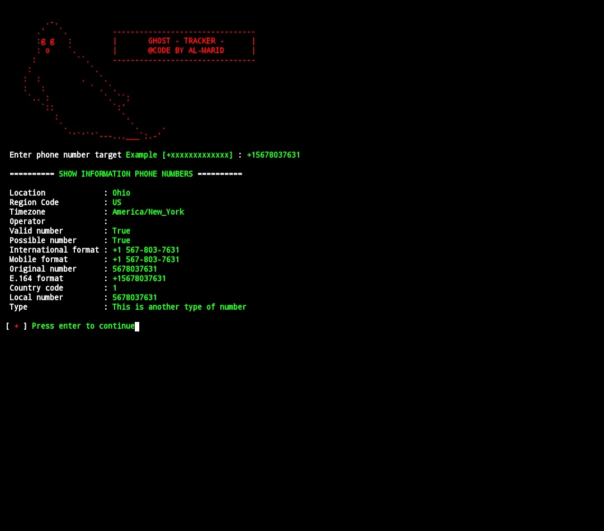
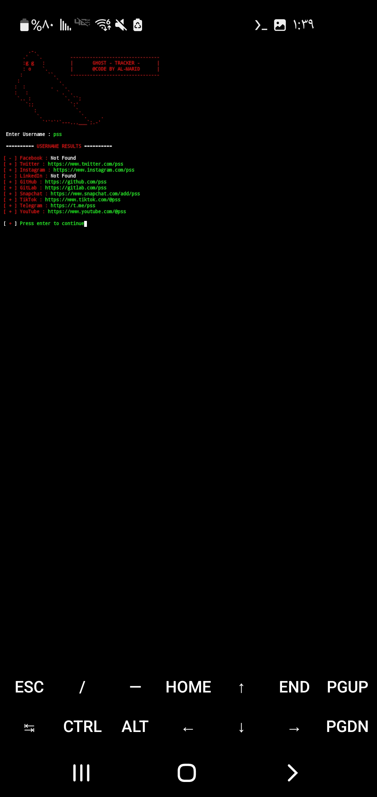

The GHOST_TRACKER tool is useful for tracking a phone number, location, and finding accounts.


## Download:
```bash
git clone https://github.com/AL-MARID/GHOST_TRACKER.git

```
## Enter the tool directory:
```bash
cd GHOST_TRACKER
```
## requirements.txt:
```bash
pip install -r requirements.txt
```
## Run the tool.
```bash
python3 GHOST_TRACKER.py
```


# GHOST TRACKER

<p align="center">
  
</p>

---

## 📸 Screenshots

<table align="center">
  <tr>
    <td></td>
    <td></td>
  </tr>
  <tr>
    <td></td>
    <td></td>
  </tr>
</table>
